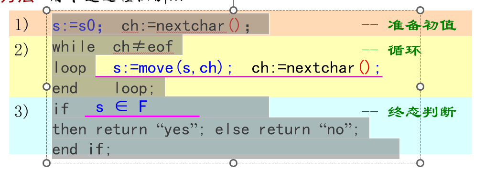
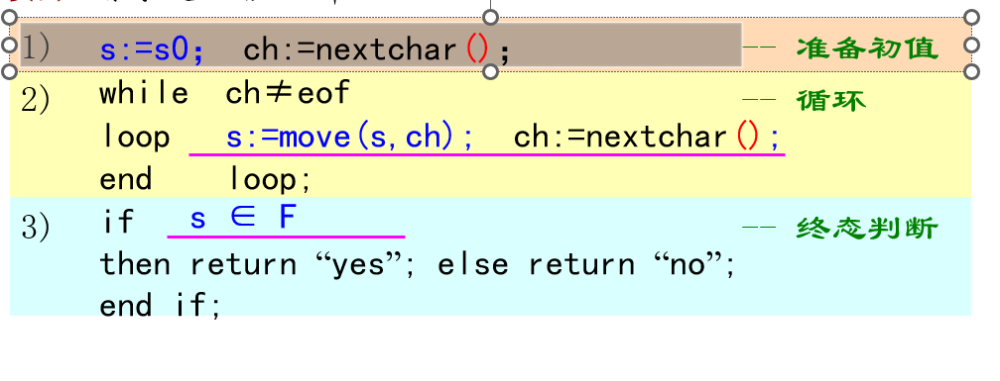
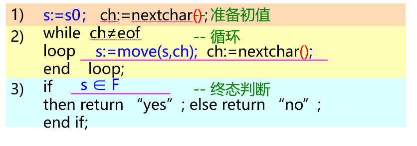
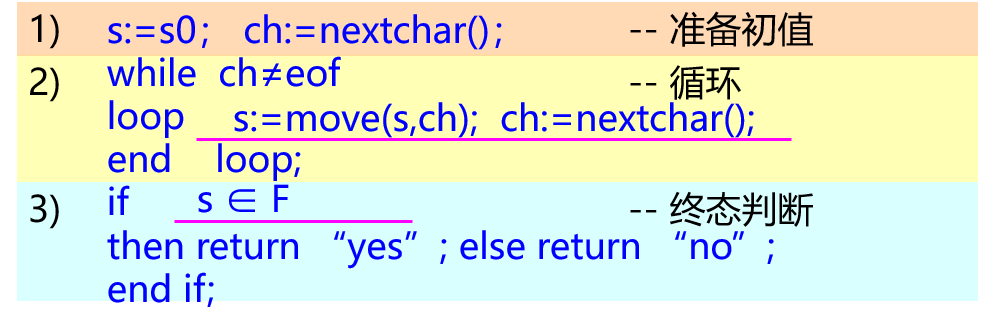

## pptFontStandardize
一键设置PPT字体，统一所有页面字体。

## 使用方法
1. 打开PPT(**需要使用MS Office**)，按Alt+F11打开VBE开发环境
2. 将Set_PPT_Font.bas拖入VBE左侧文件小窗口
3. 将鼠标光标移至Sub main()
4. 按Ctrl+H将默认字体"Microsoft YaHei"替换为你想设置的字体
5. 点击F5执行程序

**注意**
该程序不支持PPT里的SmartArt，请手动设置含有SmartArt页面的字体。

## New Feat

考虑到一些ppt的格式排版很神秘，例如，**`s:=s0`等语句** 和 **"准备初值"** 是两个文本框，而之所以 **"准备初值"** 能出现在右侧是前面加了大量空格，但是各字体的空格大小是不同的所以可能出现乱码



使用原脚本后效果为：


在添加了如下代码后，效果可以得到改善。

```vb
' Replace every space with two spaces
txt = Replace(txt, "          ", "               ") ' 10 spaces to 15 spaces
```


